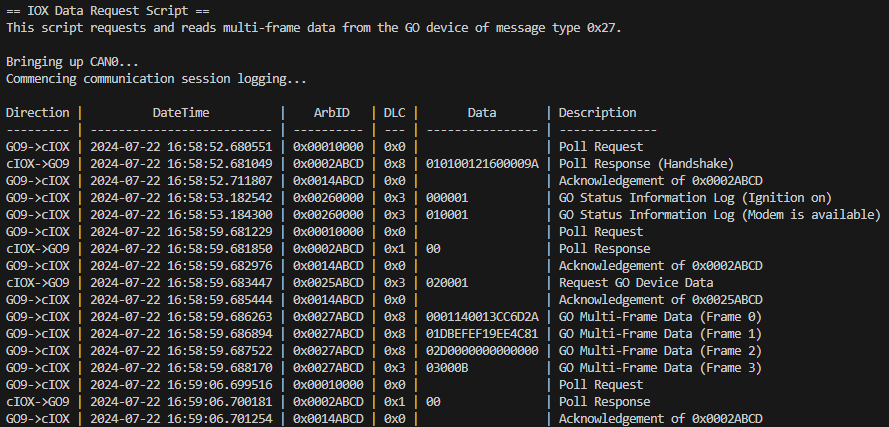
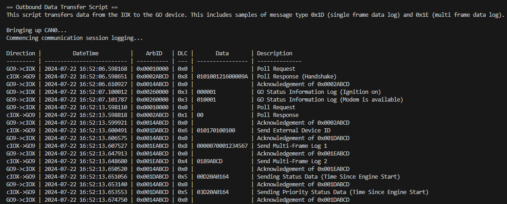

# GO/IOX Data Transfer Sample
This directory demonstrates how to send and receive data between the IOX and GO devices over the CAN bus. The data is transmitted in both single-frame and multi-frame data logs, and is closely associated with messages 0x1D, 0x1E, and 0x27. Data transmission from the IOX to the GO device can occur at any time following the handshake, and the IOX can request data from the GO device following the handshake.

## `iox_data_request.py`
This script is responsible for requesting GO data and reading the response. It runs on the IOX device, logs all inbound messages, and has two primary functions.
1. Upon bringing up the CAN bus, the IOX handshakes (0x02) in response to the first poll request (0x01) and responds to all other poll requests. 
2. After the second poll request is acknowledged by the GO device (0x14), the IOX requests status data from the GO through 0x25 type 0x02. 

The GO device receives this message and in response pushes a 0x27 multi-frame data log containing information associated with time, location, speed, odometer, RPM, engine hours, etc. Changing the payload of the outbound 0x25 message (specifically the first two bytes) will render different GO data logs in response.

### Sample CAN Logging of IOX Data Request
Here is a sample log of requesting and receiving 0x27 type 0x02 data:

### `iox_data_request2.py`
The `iox_data_request2.py` file sends two identification requests from the GO device; one requesting its serial number (0x25 type 0x12 type 0x00) and another requesting its firmware version (0x25 type 0x12 type 0x01). The GO responds with a multi-frame data log (0x27) of type 0x12. Each byte is an ASCII character for the serial number for the type 0x00 request. For the 0x02 data log, each firmware version component product, major, and minor consists of two bytes in Little Endian. Byte 0 of each of these messages confirms the payload type. This way a payload 0x78 0x00 0x2A 0x00 0x1D 0x00 would be decoded as firmware version 120.42.29, isolating from the 0x25 overhead and the data log frame counter.

## `outbound_data_transfer.py`
This script is responsible for sending both multi-frame and single-frame data logs to the GO device. It runs on the IOX device, logs all inbound messages, and has five primary functions.
1. Upon bringing up the CAN bus, the IOX handshakes (0x02) in response to the first poll request (0x01) and responds to all other poll requests. 
2. After the second poll request is acknowledged by the GO device (0x14), the IOX declares its device ID in a single frame data log (0x1D type 0x01).
3. After the previous outbound message is acknowledged by the GO device (0x14), the IOX sends free-format third party data in a two-frame data log containing the message "0123456789abcd" (0x1E).
4. After the previous outbound message is acknowledged by the GO device (0x14), the IOX pushes status data in a single frame data log indicating a value of 100 for the time since engine start (0x1D type 0x00).
5. After the previous outbound message is acknowledged by the GO device (0x14), the IOX sends *priority* status data in a single frame data log indicating a value of 100 for the time since engine start (0x1D type 0x03).

Unlike MIME messaging, the GO device does not confirm the reception of messages, other than the 0x14 ACK messages. The payloads can be adjusted to send different values or types of data to the GO device based on the 0x1D and 0x1E [IOX protocol documentation](https://developers.geotab.com/hardware/guides/IOExpanderProtocol#commands).

### Sample CAN Logging of Outbound Data Transfer
Here is a sample of sending single-frame and multi-frame data logs under structures 0x1D and 0x1E:

