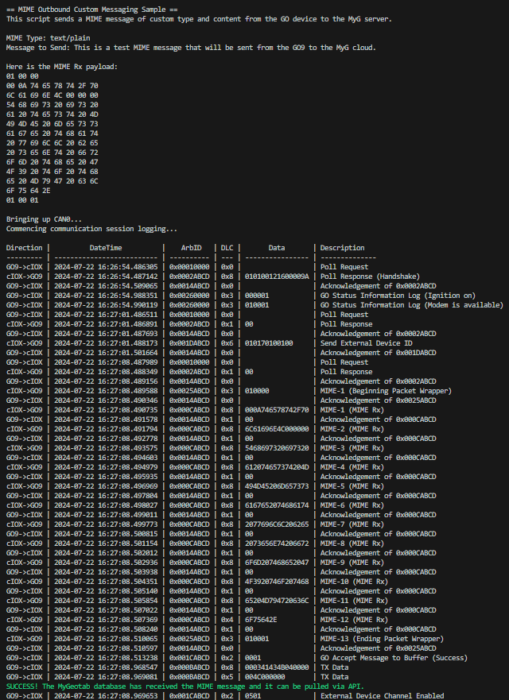
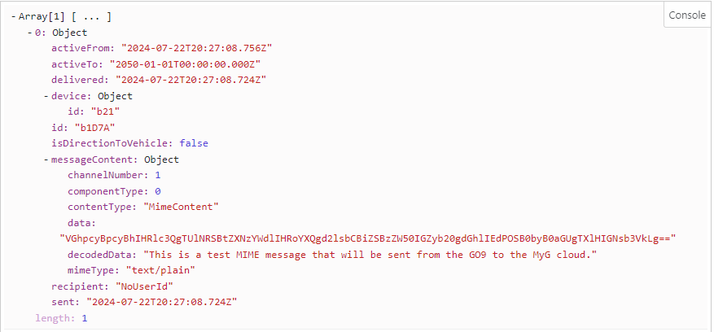

# MIME Outbound Messaging Sample
This directory demonstrates how to send and receive MIME messages going from the IOX to the GO device to the MyGeotab server. The Python script configures the payload under the MIME protocol and pushes the message to the GO device over CAN. Following reception of the MIME message from the IOX, the data is transmitted to the MyGeotab server and retrieved via the MyG API.

The MIME protocol can be used to exchange data between MyGeotab and an external device when the total message size exceeds the packet. To learn more about payload structuring under the MIME protocol, visit the [Geotab docs](https://developers.geotab.com/hardware/guides/mimeProtocol).

## MIME_outbound_sample.py
This script runs on the IOX device, logs all inbound messages, and has three primary functions.
1. Upon bringing up the CAN bus, the IOX handshakes (0x02) in response to the first poll request (0x01) and responds to all other poll requests. 
2. After the second poll request is acknowledged by the GO device (0x14), the IOX declares its device ID in a single frame data log (0x1D). This permits the received RX data (0x0C) to be pushed to the modem's socket buffer, which is necessary for transmission to the MyGeotab server.
3. After the third poll request is acknowledged by the GO device (0x14), the IOX initiates the process of pushing the constructed MIME message to the GO device. It first sends the beginning packet wrapper (0x25 type 0x01), then the MIME payload through RX data (0x0C), then the ending packet wrapper (0x25 type 0x01). Between each message, the script waits for the GO's acknowledgement of each message (0x14). 

When the ending packet wrapper message is transferred to the GO device, the GO will update the IOX on the status of the message transmission after the final acknowledgement. The first is the modem transmission result (0x1C type 0x00), which can fail if the modem is not yet ready (see 0x26 type 0x01). A result of 0x01 indicates that the GO has accepted the message to the TCP socket buffer. The next is a TX confirmation from the MyG server (0x0B).

### Constructing the MIME Message
Before bringing up the CAN bus, the script converts the string MIME type and MIME content to the appropriate payload based on the MIME protocol structuring. A payload list is created that has the sequence number, MIME type length, binary MIME type, 4-byte Little Endian payload length, and binary MIME content appended sequentially. Then, the list is split into 8 byte sequences such that each list is sent as a singular message.

### Sample CAN Logging from Python Script

\
The reception of the TX data 0x0B confirms that the MIME message has been pushed to the cloud.

## MIME_retrieve.js
This script is responsible for retriving the MIME message sent from the GO device. The script contains a function that makes an API get call for the [TextMessage](https://developers.geotab.com/myGeotab/apiReference/objects/TextMessage) entity. The function then filters to only include TextMessages that were sent from the vehicle within the last 24 hours, and are of MIME type. These objects are then sorted by Sent property, ascending. Each TextMessage object then gets a property added within the messageContent sub-object named decodedData that decodes the received message from base64 to ASCII. MyG internally re-constructs the payload from MIME protocol; this is not done in the JS script. An array of TextMessage objects with the applied modifications is logged to the console as the output.

### Sample Retrieved MIME Message

Using [MIME_retrieve.js](MIME_retrieve.js), we can extract and decode the message from the MyGeotab server:
