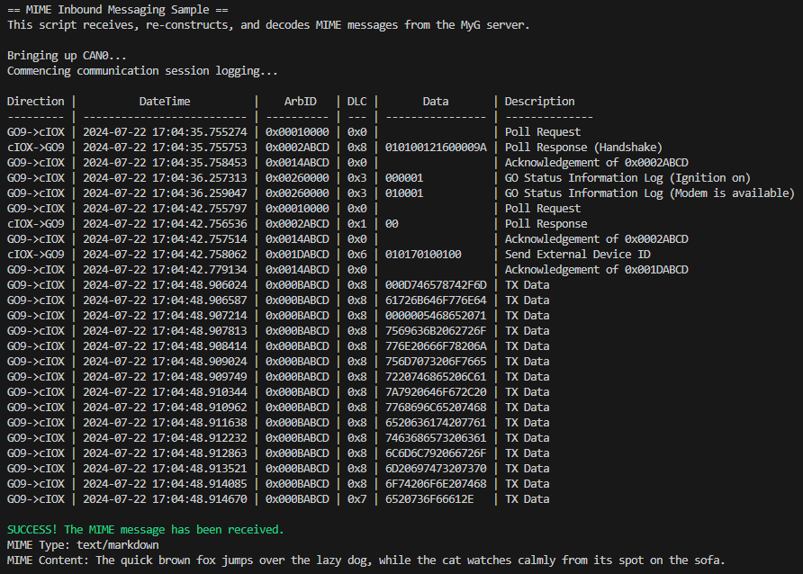

# cIOX Embedded Communication Samples via CAN
This repository offers a comprehensive set of sample scripts designed for embedded development and testing of custom Input/Output Expander (cIOX) devices. These scripts facilitate communication between the IOX device, the GO device, and MyGeotab servers through the CAN bus and MyGeotab cloud interfaces.

The repository offers practical examples of IOX device interactions over CAN and the MyGeotab cloud, aiming to improve understanding and implementation of the IOX protocol. These samples help developers and integrators streamline their testing and development processes, ensuring reliable communication and accurate data exchange within the embedded system.

## Functionality Overview
This repository is designed to deepen the understanding of the IOX protocol by providing examples of key communication processes, entailing the following:

### IOX Internal Logic
The repository includes scripts that demonstrate how to read and process inbound CAN messages, construct outbound messages from the IOX device, and transmit them over the CAN bus to the GO device. These messages can then be sent to MyGeotab servers, facilitating cloud-based interactions.

### MyGeotab Cloud Interactions
The scripts also cover how to use the MyGeotab API to send and receive information over the cloud. This includes handling the transmission of data from the GO device to the MyGeotab servers and retrieving it for further processing.

### Message Logging
The scripts capture and log all inbound and outbound messages over the CAN bus, allowing developers to monitor and analyze the data exchanged between the IOX and GO devices. This logging functionality helps in debugging and ensures that the data flow is as expected. Here is an example of a MIME message being read and decoded by the IOX:



The logging table contains the following information for each message:
| Log Field | Definition |
|-----------|------------|
| Direction | Indicates whether the message was sent or received, providing context on the flow of data through the CAN bus |
| DateTime | Records the time at which the message traverses the CAN bus |
| ArbID | Displays the arbitration ID of the message, as used in the arbitration process |
| DLC | Shows the Data Length Code, a field in the CAN frame specifying the length of the payload in bytes |
| Data | Contains the payload of the message, displayed in hexadecimal |
| Description | Provides a narrative or classification of the message's effect based on the arbitration ID and payload |

## Directory Structure
### MIME_inbound
This directory contains scripts that handle the reception and processing of MIME messages. Messages are pushed from the MyGeotab SDK API to the cloud, received by the GO device, and transmitted over CAN to the IOX device. The script then reads, decodes, and reconstructs the MIME message. For detailed documentation, see [here](MIME_inbound/README.md).

### MIME_outbound
Scripts in this directory manage the construction and transmission of MIME messages from the IOX device to the MyGeotab server. The script encodes a given message into a payload under the higher level MIME protocol structure. The payload is pushed through the MyGeotab cloud via the GO device’s TCP socket buffer and modem. An API call then retrieves and decodes the message from the cloud. For more information, refer to [this](MIME_outbound/README.md) documentation.

### GO_IOX_data_transfer
This directory contains scripts for transferring single-frame and multi-frame data log types 0x1D, 0x1E, and 0x27 between the IOX and GO devices. This entails the requesting, transmission, and retrieval of status, priority, and free-format third party data. For a comprehensive overview, see [here](GO_IOX_data_transfer/README.md).

### custom_messaging
This directory includes scripts for sending and retrieving custom messages using 0x1E multi-frame data logs from an IOX device to a GO device via the CAN bus. The custom_messaging.py script constructs and sends the custom payloads, while custom_messaging_retrieve.js fetches and decodes these messages from the MyGeotab cloud. For further details, refer to the [custom_messaging README](custom_messaging/README.md).

### functions.py
This script defines functions for sending messages over the CAN terminal and classifying inbound messages based on arbitration ID and payload. These functions are crucial for effective logging and payload handling.

### idle_communication_template.py
This script provides a minimal implementation for communication between the GO and IOX devices. Thus, it can serve as a template for GO/IOX interaction script development over the CAN bus. Upon bringing up the CAN bus, the IOX handshakes (0x02) in response to the first poll request (0x01) and responds to all other poll requests. After the second poll request is acknowledged by the GO device (0x14), the IOX declares its device ID in a single frame data log (0x1D).

## Configuration
These sample scripts are developed using the PiCAN board, which is a CAN bus interface for Raspberry Pi. CAN message transmission and reception are handled using the `python-can` library. API interactions are managed through the MyGeotab SDK API, accessible [here](https://geotab.github.io/sdk/software/api/runner.html). Scripts that control IOX behavior are implemented in Python, while API calls are executed in JavaScript.

### Setting Up the Environment
**Linux/macOS**: To install dependencies, run the following command in your terminal:
```
bash install_dependencies.sh
```
**Windows**: To install dependencies, run the following command in your PowerShell:
```
./install_dependencies.ps1
```

## Resources
The following resources pertain to the IOX communication sample in this repository:
- [IOX Protocol](https://developers.geotab.com/hardware/guides/IOExpanderProtocol)
- [Sample IOX Communication Session over CAN](https://docs.google.com/document/d/1BExcPst5bNzv-IZGX6ZbPeHK5MO1s2AI0rqzEhHbNZ4)
- [MyGeotab SDK API Runner](https://geotab.github.io/sdk/software/api/runner.html)
- [MIME Protocol](https://developers.geotab.com/hardware/guides/mimeProtocol)