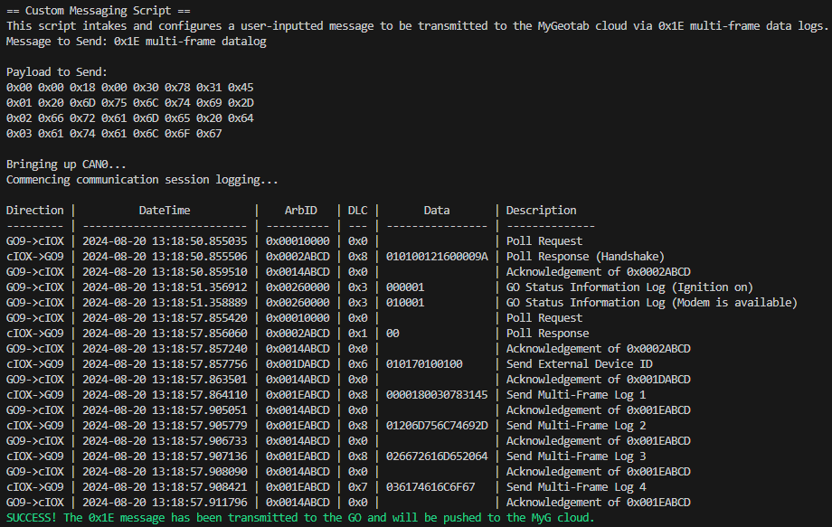
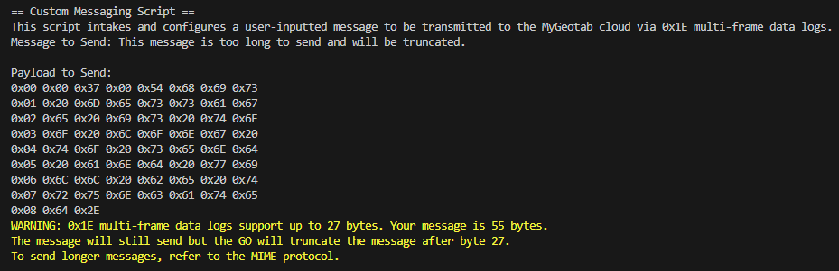
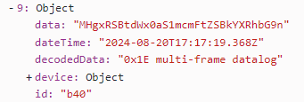

# Custom Messaging Sample
This directory demonstrates how to send custom messages from a custom IOX device to a GO device via the CAN bus and retrieve them from the MyGeotab API. The data is transmitted using multi-frame data logs (0x1E) of the third-party free format data type (0x00). This custom messaging method involves defining, constructing, and sending a message in the 0x1E format to the GO device, which then pushes the data to the MyGeotab cloud. After transmission, the data can be retrieved and decoded to reconstruct the original custom message.

This 0x1E custom messaging approach differs from [MIME messaging](../MIME_outbound) in several ways:
- Payload length is limited to 27 bytes (see more below).
- No integrated content types are used.
- Absence of 0x25 packet wrappers.
- Absence of 0x0B TX MyG reception confirmation

Consequently, 0x1E logs are preferable for simpler, lightweight messaging tasks.

## custom_messaging.py
This script constructs the payload from the custom message string and sends it to the GO device. It operates on the IOX device, logging all inbound messages, and includes three primary functions:
1. Upon initiating the CAN bus, the IOX device performs a handshake (0x02) in response to the initial poll request (0x01) and acknowledges all subsequent poll requests.
2. After the GO device acknowledges the second poll request (0x14), the IOX sends the external device ID using 0x1D type 0x01.
3. Converts the custom message string into properly structured 0x1E payloads and sequentially sends these payloads upon receiving 0x14 ACK responses for each preceding payload.

The GO device receives the 0x1E multi-frame data log and forwards it to the MyGeotab cloud, which can be accessed via the API. Unlike MIME messaging, the GO device does not provide specific confirmation of message reception beyond the 0x14 ACK responses. Multi-frame data log transmissions can occur at any time post-handshake.

### Sample CAN Logging of Custom Messaging
Here is a sample log of pushing a custom 0x1E multi-frame data log to the GO:

### Protocol Limitations
The maximum length for multi-frame log data is 27 bytes, excluding the 0x1E structure overhead, such as frame counters and data length/type identifiers. Given that each character is represented as a byte, the maximum allowable message length is 27 characters. Messages exceeding this limit will be truncated to 27 characters by the GO device before transmission to the server. Note that the ACK messages remain unchanged and do not indicate truncation. For example, a message that exceeds the 27-character limit will appear truncated upon retrieval from the API, as shown below:

## custom_messaging_retrieve.js
This script is responsible for retriving the custom message sent from the GO device. The script contains a function that makes an API get call for the [CustomData](https://developers.geotab.com/myGeotab/apiReference/objects/CustomData) entity. The function then filters to only include CustomData objects that were sent from the vehicle within the last 24 hours. These objects are then sorted by their `dateTime` property, ascending. Each CustomData object then gets a property added named decodedData that decodes the received message from base64 to ASCII. An array of CustomData objects with the applied modifications is logged to the console as the output.

### Sample Retrieved Custom Message
Using [custom_messaging_retrieve.js](custom_messaging_retrieve.js), we can extract and decode the message from the MyGeotab server:

